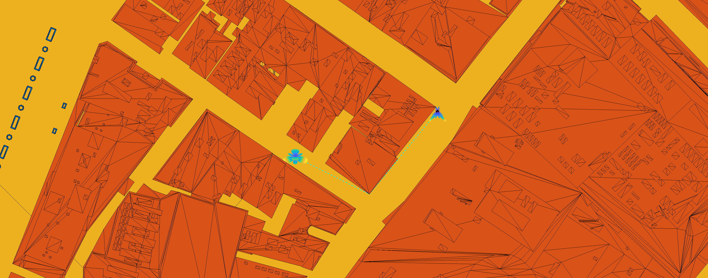
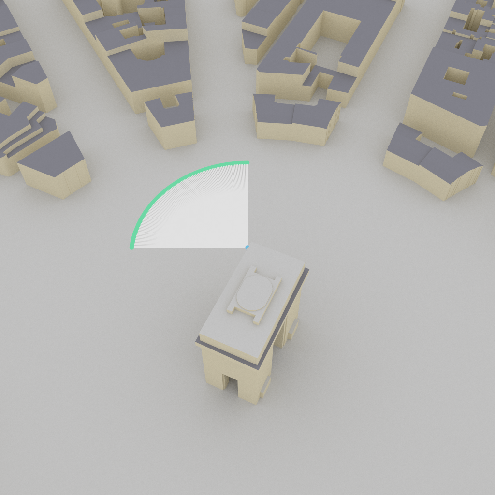
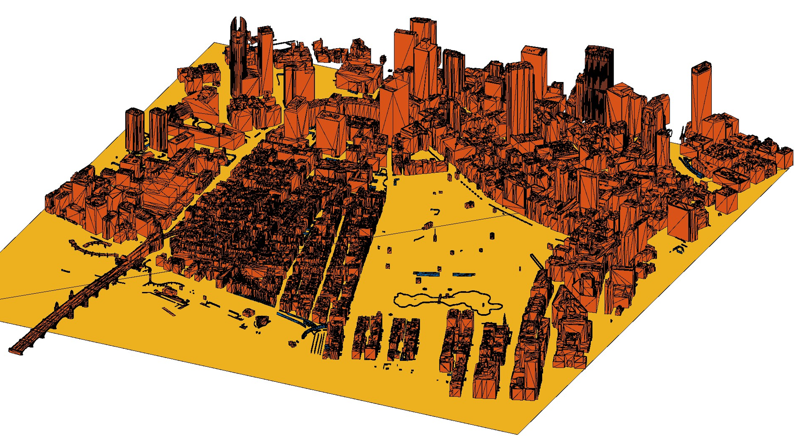

# SioLENA: 5G NR Traces Channel Model Simulation

This repository hosts the implementation of 5G NR ns-3 simulation using trace-based channel modeling. The simulation leverages pre-computed channel traces from ray-tracing software (e.g., Sionna) or measurement campaigns to provide high-fidelity channel representation for 5G New Radio (NR) systems.

*This repository enables the reproduction of results from the paper "Enabling Site-Specific Cellular Network Simulation Through Ray-Tracing-Driven ns-3" by Tanguy Ropitault, Matteo Bordin, Paolo Testolina, Michele Polese, Pedram Johari, Nada Golmie, and Tommaso Melodia, submitted to CCNC 26.*


## Table of Contents

1. [Repository Dependencies and Origins](#repository-dependencies-and-origins)
2. [Prerequisites and Building](#prerequisites-and-building)
3. [Quick Start](#quick-start)
4. [Overview of the Implementation](#overview-of-the-implementation)
5. [Traces Channel Model Architecture](#traces-channel-model-architecture)
6. [Reproducing Paper Results](#reproducing-paper-results)
7. [Detailed Usage and Parameters](#detailed-usage-and-parameters)
8. [Beamforming Configuration](#beamforming-configuration)
9. [Output Files and Analysis](#output-files-and-analysis)
10. [Contributing](#contributing)
11. [References](#references)
12. [License](#license)
13. [Authors](#authors)
14. [Contact](#contact)

## Repository Dependencies and Origins

This repository reuses the [5G LENA repository (v4.0) (included in this repository)](https://gitlab.com/cttc-lena/nr) extended to support trace-based channel model, and  [ns-3 version 3.44 (included in this repository)](https://www.nsnam.org/releases/ns-3-44/) . The 5G LENA module provides the core New Radio (NR) functionality for 5G simulations.

The **trace-based channel modeling implementation** is based on the [ns-3 QD app code](https://github.com/signetlabdei/qd-channel) and has been modified by NIST and Northeastern University for enhanced functionality and integration with the 5G LENA NR module.

## Prerequisites and Building

### System Requirements

* **ns-3**: Version 3.44 or compatible (included in this repository)
* **5G LENA**: Version 5g-lena-v4.0 (included in this repository)

### Building the Code

1. **Clone the repository**:
   ```bash
   git clone https://github.com/usnistgov/siolena
   cd ns-3-dev
   ```

2. **Configure the build**:
   
   **Recommended: Optimized build (faster simulation)**:
   ```bash
   ./ns3 configure --enable-examples --enable-tests --build-profile=optimized
   ```
   
   **Alternative: Debug build (slower but with debugging information)**:
   ```bash
   ./ns3 configure --enable-examples --enable-tests --build-profile=debug
   ```

3. **Build the code**:
   ```bash
./ns3 build
```

4. **Verify the build**:
   ```bash
   ./ns3 run "traces-channel-example --PrintHelp"
   ```

## Quick Start

To start the simulation with default settings:

```bash
./ns3 run "traces-channel-example"
```


## Overview of the Implementation

The traces channel model implementation mainly consists of:

* **Traces Channel Model (`contrib/nr/model/traces-channel-model.h/cc`)**: A matrix-based channel model that reads pre-computed channel traces from files
* **Traces Spectrum Propagation Loss Model (`contrib/nr/model/traces-spectrum-propagation-loss-model.h/cc`)**: Handles spectrum propagation and beamforming calculations
* **Traces Channel Example (`contrib/nr/examples/traces-channel-example.cc`)**: A comprehensive simulation example demonstrating the complete setup of a trace-based channel model

## Traces Channel Model Architecture

The traces channel model reads channel data from structured files located in the `contrib/nr/utils/channels/trace-based/Scenarios/` folder. Each scenario is having the same organization described below:

```
Scenarios/
├── ScenarioName/
│   ├── Input/
│   │   └── paraCfgCurrent.txt          # Simulation parameters such a nb of timesteps and timestep duration
│   └── Output/
│       ├── Ns3/
│       │   ├── NodesPosition/
│       │   │   ├── device0.csv         # Device 0 positions for the entire simulation
│       │   │   ├── device1.csv         # Device 1 positions for the entire simulation
│       │   │   └── ...
│       │   └── Channel/
│       │       ├── Tx0Rx1.txt         # Channel traces for device 0 device 1
│       │       ├── Tx1Rx0.txt         # Channel traces for device 1 device 0
│       │       └── ...
```

The organization and format is inherited from the [NIST Q-D realization software](https://github.com/wigig-tools/qd-realization) format. 
The folder naming is expressed from the raytracing software's point of view, where the `Input` folder corresponds to the input parameters provided to the raytracer, and the `Output` folder contains the results generated by the raytracer. To generate the channels used in this repository, we used [Sionna RT](https://nvlabs.github.io/sionna/rt/index.html) through the [Sionna Ray Tracing Channel Model Generator](https://github.com/wineslab/sionna-channel-generator).

### Channel Trace File Format

Each trace file Txy_Rxz.txt contains multipath component (MPC) data for each timestep:
- Number of MPCs
- Path delays (seconds)
- Path gains (dB)
- Path phases (radians)
- Elevation angles of departure (AoD)
- Azimuth angles of departure (AoD)
- Elevation angles of arrival (AoA)
- Azimuth angles of arrival (AoA)

## Reproducing Paper Results

This repository enables the reproduction of results from the paper "Enabling Site-Specific Cellular Network Simulation Through Ray-Tracing-Driven ns-3" submitted to CCNC 26. The following commands reproduce the specific results presented in the paper.

### Section IV.A - Beamforming Analysis (Etoile Scenario)

**Scenario Summary:**  


A single gNB operating at 28 GHz with 100 MHz bandwidth is mounted atop the Arc de Triomphe (Place de l'Étoile, Paris), and a UE at 1.5 m height traverses a circular arc around it. Over 8.9 s, the UE moves which varies the gNB's azimuth Angle of Departure from 0 ° to 90 °, stepping 1 ° every 100 ms. Two gNB phased-array configurations (16×16 and 16×128) and a UE 4×4 array are evaluated. The channel has been generated using [this](https://github.com/wineslab/sionna-channel-generator/blob/master/main_etoile_example.py) Sionna Ray Tracing Channel Model Generator script.

To reproduce the beamforming results for the 16x16 gNB:

```bash
./ns3 run "traces-channel-example --gNbNum=1 --ueNumPergNb=1 --lambda=1 --gnbNumRows=16 --gnbNumColumns=16 --ueNumRows=4 --ueNumColumns=4 --tracesScenario=Etoile --useAngularScanning=true --txZenithStep=10.0 --rxZenithStep=10.0 --txAzimuthStep=1.0 --rxAzimuthStep=90.0 --txZenithStart=127.5 --txZenithEnd=128.5 --rxZenithStart=52.5 --rxZenithEnd=53.5"
```

To reproduce the beamforming results for the 16x128 gNB:

```bash
./ns3 run "traces-channel-example --gNbNum=1 --ueNumPergNb=1 --lambda=1 --gnbNumRows=16 --gnbNumColumns=128 --ueNumRows=4 --ueNumColumns=4 --tracesScenario=Etoile --useAngularScanning=true --txZenithStep=10.0 --rxZenithStep=10.0 --txAzimuthStep=1.0 --rxAzimuthStep=90.0 --txZenithStart=127.5 --txZenithEnd=128.5 --rxZenithStart=52.5 --rxZenithEnd=53.5"
```

It is worth mentionning that the tx parameters always refer to the gNB(s) ones and thus the rx parameters correspond to the UE(s) ones.

**Configuration Details:**
- **Zenith Angle Limitation**: We limit the zenith angles to specific ranges (TX: 127.5 ° to 128.5 °, RX: 52.5 ° to 53.5 °) to accelerate simulation runtime by fixing the zenith angles to the Angle of Departure and Angle of Arrival for the gNB and UE respectively,and focusing on azimuth scanning
- **Azimuth Resolution**: TX azimuth step is set to 1 ° for high precision, while RX azimuth step is 90 ° for the UE
- **Direction**: Results are presented from gNB to UE, hence the different azimuth step configurations

**Output Files for Analysis:**
- **Beamforming results**: Check `Results/Etoile/traces/GnodeB_16x16_UE_4x4/beamformingVector.csv` (or `GnodeB_16x128_UE_4x4/` for 16x128 gNB)
- **Detailed file descriptions**: See the [Output Files and Analysis](#output-files-and-analysis) section below

### Section IV.B - Performance Analysis (Boston Street Canyon Scenario)

**Scenario Summary:**  



A single gNB equipped with a 16×16 planar phased-array antenna is mounted at 10 m height in an urban micro (UMi) street-canyon "Boston Twin" environment. A UE carrying a 4×4 planar array at 1.5 m height moves at a pedestrian speed of 1.5 m/s along a 375 m trajectory over 250 s, passing through three regions: Street A (0–67 s, NLoS), Street B (67–182 s, primarily LoS except 172–180 s), and Street C (182–250 s, NLoS). Performance is compared between the trace-based channel model generated using [this](https://github.com/wineslab/sionna-channel-generator/blob/master/main_boston_example.py) Sionna Ray Tracing Channel Generator script, and the 3GPP TR 38.901 UMi statistical model. Traffic is a constant-bitrate downlink UDP stream at 122 Mb/s (1500 B packets), and beamforming training occurs every 100 ms with a 10 ° scan resolution in both azimuth and elevation at the transmitter and 20 ° in azimuth and 10 ° in elevation at the receiver.

To reproduce the performance analysis results presented in Section IV.B of the paper for the trace-based channel model:

```bash
./ns3 run "traces-channel-example --gNbNum=1 --ueNumPergNb=1 --lambda=10000 --gnbNumRows=16 --gnbNumColumns=16 --ueNumRows=4 --ueNumColumns=4 --tracesScenario=BostonStreetCanyon --useAngularScanning=true --txZenithStep=10.0 --rxZenithStep=10.0 --txAzimuthStep=10.0 --rxAzimuthStep=20.0 --txZenithStart=0 --txZenithEnd=180 --rxZenithStart=0 --rxZenithEnd=180"
```

To reproduce the performance analysis results presented in Section IV.B of the paper for the 3GPP channel model:
```bash
 ./ns3 run "traces-channel-example --gNbNum=1 --ueNumPergNb=1 --lambda=10000 --gnbNumRows=16 --gnbNumColumns=16 --ueNumRows=4 --ueNumColumns=4  --tracesScenario=BostonStreetCanyon --useAngularScanning=true --txZenithStep=10.0 --rxZenithStep=10.0 --txAzimuthStep=10.0 --rxAzimuthStep=20.0 --txZenithStart=0 --txZenithEnd=180 --rxZenithStart=0 --rxZenithEnd=180 --channelModel=3GPP"
```

**Configuration Details:**
- **Full Angular Search**: Complete zenith angle range (0 °-180 °) for comprehensive analysis
- **Balanced Precision**: Beamforming parameters optimized for good precision while maintaining reasonable runtime

**Output Files for Analysis:**
- **SINR measurements**: Check `Results/BostonStreetCanyon/traces/GnodeB_16x16_UE_4x4/sinr_trace.csv`
- **End-to-end performance**: Check `Results/BostonStreetCanyon/traces/GnodeB_16x16_UE_4x4/flow_stats.csv` for throughput, delay, and PDR metrics
- **Detailed file descriptions**: See the [Output Files and Analysis](#output-files-and-analysis) section below


### Sionna-to-ns-3 Device Mapping Process
The traces channel model bridges Sionna-generated channel data (or any other raytracing software/measurements) with ns-3 simulation entities through a systematic ID mapping process. This section explains how to properly structure your channel generation to work with the ns-3 traces channel model.

#### Fundamental Mapping Principle

**Channel Generation Software → ns-3 ID Mapping:**
- **Device IDs** in your channel generation script must follow a specific ordering
- **ns-3 node IDs** are assigned sequentially starting from 0
- **Direct mapping**: Device X → ns-3 Node ID X

#### Critical Device Ordering Assumption

**⚠️ IMPORTANT: Device Ordering in Channel Generation**

When generating channel traces (using Sionna, other raytracing software, or measurements), you **MUST** follow this device ordering:

1. **gNBs first**: The first `gNbNum` devices (IDs 0 to `gNbNum-1`) must be gNBs/base stations
2. **UEs second**: The remaining devices (IDs `gNbNum` and beyond) must be UEs/user equipment


**Example Sionna Device Assignment:**
```python
# For --gNbNum=2 --ueNumPergNb=2
# Sionna device IDs:
# Device 0: gNB 0
# Device 1: gNB 1  
# Device 2: UE 0 (attached to gNB 0)
# Device 3: UE 1 (attached to gNB 0)
# Device 4: UE 2 (attached to gNB 1)
# Device 5: UE 3 (attached to gNB 1)
```

#### Required File Structure

**Position Files:**
- **Format**: `deviceX.csv` where X is the Sionna device ID
- **Content**: Device positions (x, y, z coordinates)
- **Naming**: Must be sequential starting from `device0.csv`

**Channel Files:**
- **Format**: `TxXRxY.txt` where X is transmitter device ID, Y is receiver device ID
- **Content**: Channel MPCs
- **Naming**: Must include all required device pairs

#### Mapping Examples

**Single gNB with Single UE:**
```bash
--gNbNum=1 --ueNumPergNb=1
```

**Sionna Device Assignment:**
- Device 0: gNB (maps to `device0.csv`)
- Device 1: UE (maps to `device1.csv`)

**Required Files:**
- `device0.csv` (gNB position)
- `device1.csv` (UE position)
- `Tx0Rx1.txt` (gNB→UE channel)
- `Tx1Rx0.txt` (UE→gNB channel)

**Multiple gNBs and UEs:**
```bash
--gNbNum=2 --ueNumPergNb=2
```

**Sionna Device Assignment:**
- Device 0: gNB 0 (maps to `device0.csv`)
- Device 1: gNB 1 (maps to `device1.csv`)
- Device 2: UE 0 (attached to gNB 0, maps to `device2.csv`)
- Device 3: UE 1 (attached to gNB 0, maps to `device3.csv`)
- Device 4: UE 2 (attached to gNB 1, maps to `device4.csv`)
- Device 5: UE 3 (attached to gNB 1, maps to `device5.csv`)

**Required Files:**
- `device0.csv` through `device5.csv` (all device positions)
- **ALL Channel Combinations** (6 devices × 6 devices = 30 files, excluding self-channels):
  - **gNB-to-gNB**: `Tx0Rx1.txt`, `Tx1Rx0.txt`
  - **gNB-to-UE**: `Tx0Rx2.txt`, `Tx0Rx3.txt`, `Tx0Rx4.txt`, `Tx0Rx5.txt`, `Tx1Rx2.txt`, `Tx1Rx3.txt`, `Tx1Rx4.txt`, `Tx1Rx5.txt`
  - **UE-to-gNB**: `Tx2Rx0.txt`, `Tx2Rx1.txt`, `Tx3Rx0.txt`, `Tx3Rx1.txt`, `Tx4Rx0.txt`, `Tx4Rx1.txt`, `Tx5Rx0.txt`, `Tx5Rx1.txt`
  - **UE-to-UE**: `Tx2Rx3.txt`, `Tx2Rx4.txt`, `Tx2Rx5.txt`, `Tx3Rx2.txt`, `Tx3Rx4.txt`, `Tx3Rx5.txt`, `Tx4Rx2.txt`, `Tx4Rx3.txt`, `Tx4Rx5.txt`, `Tx5Rx2.txt`, `Tx5Rx3.txt`, `Tx5Rx4.txt`

**⚠️ IMPORTANT: Complete Channel Matrix Required**

You must generate channel files for **ALL possible device pairs** (N×N matrix for N devices), not just the gNB-UE connections. This includes:
- gNB-to-gNB channels (for inter-cell interference)
- UE-to-UE channels (for device-to-device communication)
- All cross-connections between any two devices
- **Self-channels are NOT needed** (e.g., `Tx0Rx0.txt`, `Tx1Rx1.txt`, etc.)

**Formula**: For N devices, you need N²-N channel files (excluding self-channels).


#### Key Rules for Channel Generation

1. **Device Ordering**: Always assign gNBs first (IDs 0 to `gNbNum-1`), then UEs
2. **Sequential IDs**: Use sequential device IDs starting from 0
3. **File Naming**: Name files exactly as `deviceX.csv` and `TxXRxY.txt`
4. **Total Devices**: Generate exactly `gNbNum + (gNbNum × ueNumPergNb)` devices
5. **Complete Channel Matrix**: Generate channel files for **ALL possible device pairs** (N×N matrix)
6. **No Missing Combinations**: Every device must have a channel file to every other device


#### ns-3 Internal Mapping

The ns-3 traces channel model automatically maps these files to simulation entities:

- **Sequential assignment**: Trace device IDs directly map to ns-3 node IDs
- **gNB assignment**: First `gNbNum` nodes become gNBs
- **UE assignment**: Remaining nodes become UEs
- **Attachment**: UEs are attached to gNBs based on the `attachmentMode` parameter (see below)
  - **`"closest"`**: UEs attach to the nearest gNB based on distance
  - **`"id-based"`**: UEs attach to gNBs based on their index (UE 0,1 → gNB 0, UE 2,3 → gNB 1, etc.)

**Key Parameters:**
- **`gNbNum`**: Number of gNBs (base stations) in the simulation
- **`ueNumPergNb`**: Number of UEs per gNB (total UEs = `gNbNum × ueNumPergNb`)

## Detailed Usage and Parameters

### Channel Model Configuration

* **`channelModel`**: Channel model to use. Options: `"Traces"` (default) or `"3GPP"`. The Traces model uses pre-computed channel data, while 3GPP uses the standard 3GPP channel model.

* **`tracesScenario`**: Specifies the scenario folder containing the channel traces. Default is `"Etoile"`. Available scenarios include:
  - `Etoile`
  - `BostonStreetCanyon`

### Network Topology

* **`gNbNum`**: Number of gNBs (base stations) in the simulation. Default is `1`.

* **`ueNumPergNb`**: Number of UEs per gNB. Default is `1`.

* **`attachmentMode`**: UE-gNB attachment strategy. Options:
  - `"closest"`: UEs attach to the nearest gNB based on distance
  - `"id-based"`: UEs attach to gNBs based on their index (UE 0,1 → gNB 0, UE 2,3 → gNB 1, etc.)
  Default is `"id-based"`.

### Phased Array Antenna (PAA) Configuration

* **`gnbNumRows`**: Number of antenna rows for gNB. Default is `2`.

* **`gnbNumColumns`**: Number of antenna columns for gNB. Default is `16`.

* **`ueNumRows`**: Number of antenna rows for UE. Default is `2`.

* **`ueNumColumns`**: Number of antenna columns for UE. Default is `16`.

**Note**: The antenna configuration significantly impacts beamforming performance and channel capacity. Larger arrays provide better spatial resolution and beamforming gain.

### NR System Parameters

* **`centralFrequencyBand1`**: Operating frequency in Hz. Default is `28e9` (28 GHz).

* **`bandwidthBand1`**: System bandwidth in Hz. Default is `100e6` (100 MHz).

* **`totalTxPower`**: Total transmit power in dBm. Default is `35` dBm.

* **`numerologyBwp1`**: Numerology for bandwidth part 1. Default is `3`.

### Simulation Configuration

* **`simTimeAutoSet`**: Automatically set simulation time from trace files (default: `true`)
  - **`true`**: Simulation duration is automatically read from trace files (recommended for Traces channel model)
  - **`false`**: Use manually specified `simTime` parameter

* **`simTime`**: Manual simulation duration in seconds (only used when `simTimeAutoSet=false`)
  - **Default**: Not used when `simTimeAutoSet=true`
  - **Usage**: Set this parameter when you want to override the trace file duration

### Traffic Configuration
The traffic is downlink with the following properties:
* **`lambda`**: Number of UDP packets per second. Default is `1`.

* **`packetSize`**: UDP packet size in bytes. Default is `1500`.

* **`udpAppStartTime`**: Application start time. Default is `10` ms.

## Beamforming Configuration

The simulation supports two beamforming modes controlled by the `useAngularScanning` parameter:

#### Mode 1: Angular-Based Scanning (`useAngularScanning=true`)

**Command Line Parameters:**
* **`useAngularScanning`**: Enable angular-based scanning (default: `true`)
* **`txZenithStep`**: Transmitter zenith angle step size in degrees (default: `10.0`)
* **`rxZenithStep`**: Receiver zenith angle step size in degrees (default: `10.0`)
* **`txAzimuthStep`**: Transmitter azimuth angle step size in degrees (default: `10.0`)
* **`rxAzimuthStep`**: Receiver azimuth angle step size in degrees (default: `10.0`)
* **`txZenithStart`**: Transmitter zenith angle start in degrees (default: `0.0`)
* **`txZenithEnd`**: Transmitter zenith angle end in degrees (default: `180.0`)
* **`rxZenithStart`**: Receiver zenith angle start in degrees (default: `0.0`)
* **`rxZenithEnd`**: Receiver zenith angle end in degrees (default: `180.0`)
* **`txAzimuthStart`**: Transmitter azimuth angle start in degrees (default: `0.0`)
* **`txAzimuthEnd`**: Transmitter azimuth angle end in degrees (default: `360.0`)
* **`rxAzimuthStart`**: Receiver azimuth angle start in degrees (default: `0.0`)
* **`rxAzimuthEnd`**: Receiver azimuth angle end in degrees (default: `360.0`)

**Parameter Details:**

**Angle Step Sizes (`*Step` parameters):**
- **Purpose**: Control beamforming resolution and simulation speed
- **Range**: 0.1 ° to 90 ° for zenith angles and 0.1 ° to 360 ° for azimuth angles(smaller = higher resolution, slower simulation)
- **Typical values**: 
  - High precision: 1 ° to 5 ° (for detailed beamforming analysis)
  - Balanced: 10 ° to 20 ° (for general simulations)
  - Fast simulation: 30 ° to 90 ° (for quick testing)
- **Impact**: Smaller steps increase beamforming accuracy but exponentially increase computation time

**Zenith Angle Ranges (`*ZenithStart/End` parameters):**
- **Purpose**: Control elevation angle scanning range
- **Coordinate system**: 0 ° = upward, 90 ° = horizontal, 180 ° = downward
- **Typical configurations**:
  - **gNB (transmitter)**: 90 ° to 135 ° (downward-looking, typical for rooftop/base station)
  - **UE (receiver)**: 45 ° to 90 ° (upward-looking, typical for ground-level devices)
  - **Full range**: 0 ° to 180 ° (complete spherical coverage)
- **Performance tip**: Limit zenith ranges to physically relevant angles to reduce simulation time

**Azimuth Angle Ranges (`*AzimuthStart/End` parameters):**
- **Purpose**: Control horizontal angle scanning range
- **Coordinate system**: 0 ° = East, 90 ° = North, 180 ° = West, 270 ° = South
- **Typical configurations**:
  - **Sector coverage**: 0 ° to 120 ° (120 ° sector, typical for sectorized cells)
  - **Omnidirectional**: 0 ° to 360 ° (full horizontal coverage)
  - **Directional**: 45 ° to 135 ° (specific direction, e.g., street canyon)

**Features:**
- **Precise Control**: Direct specification of angular search ranges
- **Performance Optimization**: Limit scanning to physically relevant angles
- **Scenario Adaptation**: Optimize for specific deployment environments
- **Reduced Simulation Time**: Focus on relevant angular regions

#### Mode 2: Sector-Based Scanning (`useAngularScanning=false`)

**Command Line Parameters:**
* **`useAngularScanning`**: Disable angular scanning, use sector-based approach (set to `false`)
* **`oversamplingFactor`**: Oversampling factor for sector resolution (default: `1`)

**Parameter Details:**

**Oversampling Factor:**
- **Purpose**: Control sector resolution and beamforming precision
- **Range**: 1 to 8 (higher = finer resolution, slower simulation)
- **How it works**: 
  - Base resolution is determined by antenna array dimensions
  - Oversampling factor multiplies the base resolution
  - Example: 4×4 array with oversampling=2 creates 32×32 effective resolution
- **Typical values**:
  - **Standard**: 1 (base resolution, fastest)
  - **Enhanced**: 2-4 (improved precision, moderate speed)
  - **High precision**: 6-8 (maximum precision, slowest)
- **Impact**: Higher oversampling provides better beamforming accuracy but increases computation time quadratically

**Sector Division:**
- **Automatic calculation**: Based on antenna array dimensions (rows × columns)
- **Zenith sectors**: Number of elevation sectors = `numRows × oversamplingFactor`
- **Azimuth sectors**: Number of horizontal sectors = `numColumns × oversamplingFactor`
- **Total sectors**: `(numRows × numColumns) × (oversamplingFactor)²`

**Features:**
- **5G-LENA Compatibility**: Follows established beamforming methodology
- **Array-Aware Resolution**: Automatically adapts to antenna array dimensions
- **Simplified Configuration**: Fewer parameters to configure
- **Proven Performance**: Well-tested approach in 5G simulations

#### Beamforming Periodicity

* **`beamformingPeriodicity`**: Beamforming update interval in milliseconds (default: `100`)

**Parameter Details:**

**Beamforming Update Interval:**
- **Purpose**: Control how frequently beamforming vectors are recalculated
- **Range**: 10 ms to 1000 ms (shorter = more responsive)
- **Typical values**:
  - **Fast mobility**: 10 ms to 50 ms (for high-speed scenarios)
  - **Standard**: 100 ms (default, balanced performance)
  - **Slow mobility**: 200 ms to 500 ms (for static or slow-moving scenarios)
  - **Static**: 1000 ms or longer (for fixed deployments)
- **Impact**: Shorter intervals provide better tracking of channel changes but increase computational overhead
- **Trade-off**: Responsiveness vs. simulation speed

#### Key Differences Between Modes

| Feature | Angular Scanning | Sector Scanning |
|---------|------------------|-----------------|
| **Control** | Precise angle ranges | Automatic sector division |
| **Parameters** | 12 angular parameters | 1 oversampling parameter |
| **Performance** | Optimized for specific scenarios | General-purpose approach |
| **Flexibility** | High (custom ranges) | Medium (sector-based) |


#### Critical Azimuth Angle Coverage Difference

**IMPORTANT**: There is a fundamental difference in azimuth angle coverage between the two beamforming methods:

**Angular Scanning (`useAngularScanning=true`):**
- **Azimuth Range**: **Full 360 degrees** (0 ° to 360 °)
- **Formula**: Direct conversion from degrees to radians: `azimuthAngle * π / 180`
- **Flexibility**: Configurable start/end angles and step sizes
- **Advantage**: Complete azimuth coverage with user-defined resolution

**Sector-Based Scanning (`useAngularScanning=false`):**
- **Azimuth Range**: **NOT 360 degrees** - Limited by antenna array configuration
- **Formula**: `π * (sector / numColumns) - 0.5 * π`
- **Typical Range**: -90 ° to +90 ° (or similar limited range)
- **Limitation**: The azimuth coverage is constrained by the number of antenna columns and oversampling factor

**Practical Impact:**
- **Angular scanning** can scan the full horizontal plane (0 ° to 360 °), making it suitable for omnidirectional coverage scenarios
- **Sector-based scanning** is limited to a subset of azimuth angles, typically covering a forward-looking sector. This is based on the original 5G LENA implementation where beamforming resolution is tied to antenna array dimensions

**Example:**
- For a 16×16 antenna array with sector-based scanning, the azimuth range might be limited to approximately ±90 ° around the boresight direction
- For the same array with angular scanning, you can configure any azimuth range from 0 ° to 360 ° with custom step sizes


## Output Files and Analysis

The simulation generates results in the following directory structure:

```
Results/
├── ScenarioName/
│   ├── traces/                    # Traces channel model results
│   │   └── GnodeB_16x16_UE_4x4/        # Antenna configuration subfolder
│   │       ├── sinr_trace.csv           # SINR measurements over time
│   │       ├── position_trace.csv       # UE position and velocity data
│   │       ├── flow_stats.csv           # Flow statistics (throughput, delay, PDR)
│   │       ├── beamformingVector.csv    # Beamforming vector data
│   │       ├── NrDlMacStats.txt         # NR downlink MAC layer statistics
│   │       └── simulation_results.txt   # End-of-simulation summary
│   └── 3GPP/                           # 3GPP channel model results (if used)
```

**Naming Convention**:
- **Antenna folders**: `GnodeB_[rows]x[columns]_UE_[rows]x[columns]/`
- **Example**: `GnodeB_16x16_UE_4x4/` for 16×16 gNB and 4×4 UE arrays
- **Scenario folders**: Match the `tracesScenario` parameter
- **Channel model folders**: `traces/` for traces, `3GPP/` for 3GPP model

### Output File Descriptions

#### 1. SINR Trace File (`sinr_trace.csv`)

**Purpose**: Records Signal-to-Interference-plus-Noise Ratio measurements over time
**Format**: CSV with comma-separated values
**Columns**:
- **Time(s)**: Simulation time in seconds
- **CellId**: gNB cell identifier (0, 1, 2, ...)
- **RNTI**: Radio Network Temporary Identifier (unique UE identifier)
- **SINR(dB)**: SINR value in dB (converted from linear scale)
- **BWP_ID**: Bandwidth Part identifier (usually 0 for single BWP)

**Usage**: Analyze link quality, coverage analysis, interference assessment
**Sample data**:
```csv
Time(s),CellId,RNTI,SINR(dB),BWP_ID
0.1,0,1,15.2,0
0.2,0,1,14.8,0
0.3,0,1,16.1,0
```

#### 2. Position Trace File (`position_trace.csv`)

**Purpose**: Tracks UE mobility and position changes throughout simulation
**Format**: CSV with comma-separated values
**Columns**:
- **Time(s)**: Simulation time in seconds
- **X**: X-coordinate in meters
- **Y**: Y-coordinate in meters
- **Z**: Z-coordinate in meters (height)
- **VelocityX**: X-component of velocity in m/s
- **VelocityY**: Y-component of velocity in m/s
- **VelocityZ**: Z-component of velocity in m/s

**Usage**: Mobility analysis, coverage mapping, trajectory visualization
**Sample data**:
```csv
Time(s),X,Y,Z,VelocityX,VelocityY,VelocityZ
0.1,100.5,200.3,1.5,1.2,0.8,0.0
0.2,101.7,201.5,1.5,1.2,0.8,0.0
0.3,102.9,202.7,1.5,1.2,0.8,0.0
```

#### 3. Flow Statistics File (`flow_stats.csv`)

**Purpose**: Comprehensive traffic flow performance metrics
**Format**: CSV with comma-separated values
**Columns**:
- **Time**: Simulation time in seconds
- **FlowId**: Unique flow identifier
- **Throughput(Mbps)**: Average throughput in Mbps
- **AvgDelay(ms)**: Average packet delay in milliseconds
- **AvgJitter(ms)**: Average jitter in milliseconds
- **PDR**: Packet Delivery Ratio (0-1 scale)
- **InstDelay(ms)**: Instantaneous delay in milliseconds
- **InstJitter(ms)**: Instantaneous jitter in milliseconds
- **InstPDR**: Instantaneous Packet Delivery Ratio

**Usage**: Performance analysis, QoS assessment, network optimization
**Sample data**:
```csv
Time,FlowId,Throughput(Mbps),AvgDelay(ms),AvgJitter(ms),PDR,InstDelay(ms),InstJitter(ms),InstPDR
0.2,1,10.1338,89.9863,1.15643,0.0268374,130.156,1.16384,0.028
0.3,1,10.0131,138.307,1.15934,0.0271233,227.38,1.16471,0.0276667
```

#### 4. Beamforming Vector File (`beamformingVector.csv`)

**Purpose**: Records beamforming vector evolution and optimization
**Format**: CSV with comma-separated values
**Columns**:
- **Timestamp**: Simulation time in milliseconds
- **gNB_ID**: gNB identifier
- **UE_ID**: UE identifier
- **Device**: Device type ("TX" for transmitter, "RX" for receiver)
- **ElementIndex**: Antenna element index (1-based)
- **Real**: Real part of complex beamforming coefficient
- **Imag**: Imaginary part of complex beamforming coefficient
- **Sector**: **Method-dependent field** - meaning varies based on beamforming approach:
  - **Sector-based scanning** (`useAngularScanning=false`): Sector index (0, 1, 2, ...)
  - **Angular scanning** (`useAngularScanning=true`): **Direct azimuth angle in degrees** (0 ° to 360 °)
  - **Note**: We maintain the same field name for both methods to avoid creating different file formats
- **Elevation**: Elevation angle in degrees
- **Power**: Power value

**Usage**: Beamforming analysis, antenna optimization, sector performance
**Sample data**:
```csv
Timestamp,gNB_ID,UE_ID,Device,ElementIndex,Real,Imag,Sector,Elevation,Power
100,0,1,TX,1,0.707,0.707,15,120.5,1.0
100,0,1,TX,2,0.707,-0.707,15,120.5,1.0
100,0,1,RX,1,0.707,0.707,8,45.2,1.0
```

**Important Note on Sector Field Interpretation:**
- **For sector-based scanning**: The "Sector" column contains discrete sector indices (0, 1, 2, etc.) that correspond to predefined beamforming sectors based on antenna array dimensions
- **For angular scanning**: The "Sector" column contains the actual azimuth angle in degrees (e.g., 45.0, 90.0, 135.0) that was used for beamforming
- **File format consistency**: We chose to maintain the same column name and file format for both methods to ensure compatibility and avoid the complexity of having different output file structures

#### 5. NR Downlink MAC Statistics File (`NrDlMacStats.txt`)

**Purpose**: Records detailed MAC layer statistics for downlink transmissions in 5G NR
**Format**: Tab-separated values (TSV) with header line starting with '%'
**Columns**:
- **time(s)**: Simulation time in seconds
- **cellId**: Cell identifier (gNB ID)
- **bwpId**: Bandwidth Part identifier (usually 0 for single BWP)
- **IMSI**: International Mobile Subscriber Identity (UE identifier)
- **RNTI**: Radio Network Temporary Identifier (unique UE identifier within cell)
- **frame**: System frame number
- **sframe**: Subframe number within the frame
- **slot**: Slot number within the subframe
- **symStart**: Starting symbol index within the slot
- **numSym**: Number of symbols allocated for transmission
- **harqId**: Hybrid Automatic Repeat Request process identifier
- **ndi**: New Data Indicator (1 = new data, 0 = retransmission)
- **rv**: Redundancy Version (0, 1, 2, or 3 for HARQ retransmissions)
- **mcs**: Modulation and Coding Scheme index
- **tbSize**: Transport Block size in bits

**Usage**: MAC layer analysis, HARQ performance evaluation, scheduling analysis, link adaptation studies
**Sample data**:
```% time(s)	cellId	bwpId	IMSI	RNTI	frame	sframe	slot	symStart	numSym	harqId	ndi	rv	mcs	tbSize
0.0163125	1	0	0	1	1	6	7	1	12	15	1	0	0	84
0.016375	1	0	0	1	1	6	8	1	12	14	1	0	0	84
```

#### 6. Simulation Results Summary (`simulation_results.txt`)

**Purpose**: End-of-simulation flow statistics and performance summary
**Format**: Human-readable text file
**Content**:
- **Flow Information**: Source and destination addresses, protocol type
- **Transmission Statistics**: Number of packets and bytes transmitted
- **Reception Statistics**: Number of packets and bytes received
- **Performance Metrics**: Throughput, mean delay, mean jitter
- **Packet Delivery**: Success/failure statistics

**Usage**: Quick performance overview, flow analysis, result validation
**Sample content**:
```
Flow 1 (1.0.0.2:49153 -> 7.0.0.2:1234) proto UDP
  Tx Packets: 1
  Tx Bytes:   1528
  TxOffered:  0.135822 Mbps
  Rx Bytes:   0
  Throughput:  0 Mbps
  Mean delay:  0 ms
  Mean jitter: 0 ms
  Rx Packets: 0

  Mean flow throughput: 0.000000
  Mean flow delay: 0.000000
```

## Contributing

This implementation is based on the ns-3 QD app code and has been enhanced for 5G NR simulations. Contributions are welcome for:

* Additional scenarios
* Enhanced beamforming algorithms
* Performance optimizations

## References

* [ns-3 QD Channel Model](https://github.com/signetlabdei/qd-channel) - Original QD channel implementation
* [5G LENA Repository](https://gitlab.com/cttc-lena/nr) - 5G LENA ns-3 module (version 5g-lena-v4.0)
* T. Ropitault, M. Bordin, P. Testolina, M. Polese, P. Johari, N. Golmie, T. Melodia, "Enabling Site-Specific Cellular Network Simulation Through Ray-Tracing-Driven ns-3", submitted to CCNC 26

## License

This project is licensed under the GPL-2.0 license. See the LICENSE file for details.

## Authors

* NIST & Northeastern University - Modified and enhanced the original QD channel implementation and integrated it to 5G-LENA
* SIGNET Lab, University of Padova - Original QD channel model development
* CTTC (Centre Tecnològic de Telecomunicacions de Catalunya) - 5G LENA module development

## Contact

For any questions or further information, please contact:

* **Tanguy Ropitault**
* Email: tanguy.ropitault@nist.gov

